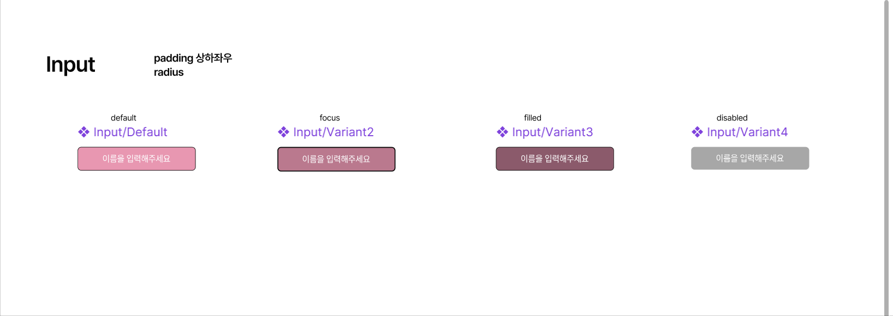
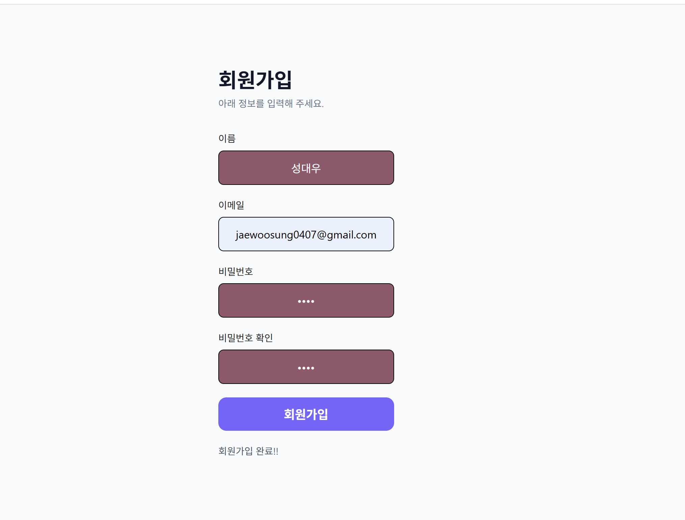

# Week 2 회원가입 페이지

React와 Tailwind CSS로 구현한 회원가입 과제입니다.

## 구현 기능

- 수업에서 만든 Button 컴포넌트 재사용
- 재사용 가능한 Input 컴포넌트
- 이름, 이메일, 비밀번호, 비밀번호 확인 입력
- default: 입력값이 없는 기본 상태
- focus: 빈 입력창에 커서를 올리거나 선택한 상태
- filled: 공백이 아닌 입력값이 있는 상태 (hover보다 우선 적용)
- disabled: 앞 입력창이 채워지기 전 비활성화된 상태
- 순차 입력 및 비밀번호 일치 여부 확인
- 회원가입 완료 메시지 표시 (서버 연결 없이 동작하는 화면 데모)

## Figma 디자인



## 구현 화면



## 실행 방법

저장소 최상위 폴더에서 실행합니다.

```sh
cd week2_assignment/week2_hw
npm install
npm run dev
```

## 빌드 및 코드 검사

과제 폴더에서 실행합니다.

```sh
npm run build
npm run lint
```
